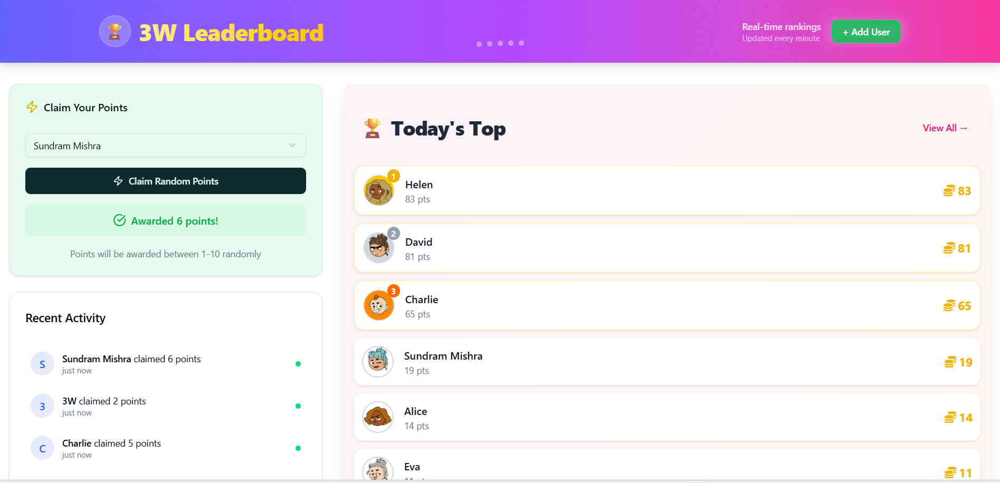
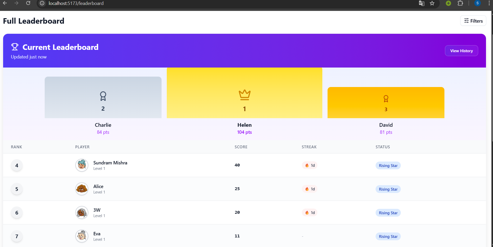
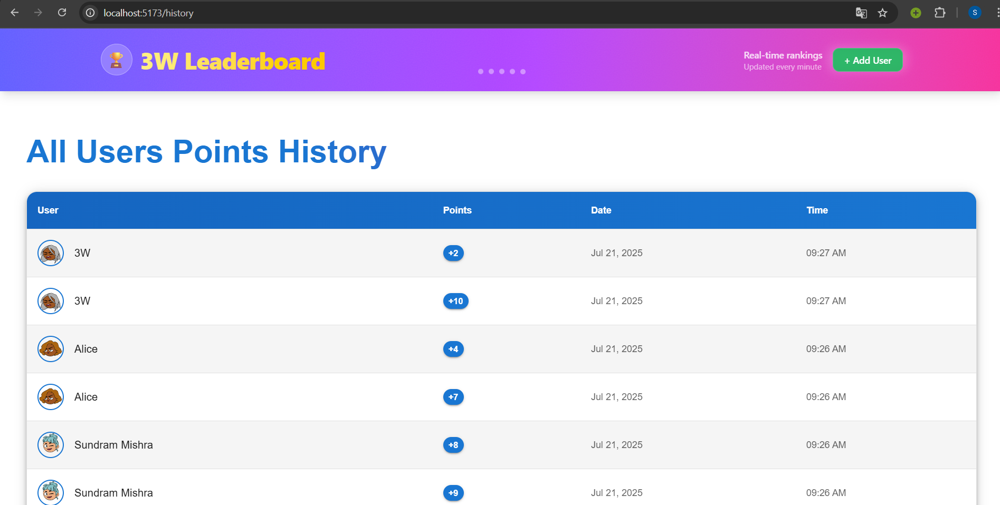

# 🏆 Leaderboard Points Claim System

A full-stack leaderboard app where users can claim random points and view dynamic, real-time ranking updates.

## 🚀 Live Preview

https://leaderboard-app-3-w.vercel.app/

---

## 📸 Screenshots

### 🏠 Home Page – Claim Points


### 📊 Leaderboard Page


### 🕓 History Page


---

## 🎯 Task Objective

Build a dynamic system where users can:
- Select one of the listed users
- Claim **random points (1–10)** for the selected user
- View **live leaderboard rankings** based on total points
- Track all past claims in a **claim history**

---

## ✨ Features

- ✅ User Selection Dropdown (with option to add new users)
- ✅ Claim Random Points (1–10)
- ✅ Real-Time Leaderboard Updates using **React Context API**
- ✅ Points History Tracking
- ✅ MongoDB-backed persistent data storage

---

## 🧠 Tech Stack

### Frontend
- ⚛️ **ReactJS** + **Vite**
- 🎨 **TailwindCSS**
- 🌐 **Axios** (API handling)
- 📦 Context API (global state management for real-time updates)

### Backend
- 🟩 **NodeJS** + **ExpressJS**
- 🍃 **MongoDB** + **Mongoose**
- 🔐 CORS + Error Middleware

---

## 🗂️ Folder Structure (Simplified)

root/
├── backend/
│ ├── controllers/
│ ├── models/
│ ├── routes/
│ ├── services/
│ └── server.js
├── frontend/
│ ├── src/
│ │ ├── components/
│ │ ├── context/
│ │ ├── pages/
│ │ └── services/
│ └── index.html
└── README.md


---

## 🛠️ Functionality Notes

- **Claiming Points**:
  - You select a user.
  - Click the **Claim** button.
  - Backend generates a random number (1–10).
  - Updates user’s total points.
  - Adds a new entry in the **Points History** collection.

- **Leaderboard**:
  - Automatically re-sorts after every claim based on total points.
  - Users are ranked dynamically in real time.

- **History**:
  - Shows when, which user claimed, and how many points were assigned.
  - Paginated backend for efficient large-scale viewing.

---

## 📡 API Endpoints (Backend)

- `GET /api/users` – Fetch all users
- `POST /api/users` – Create new user
- `GET /api/users/top?limit=5` – Top users
- `POST /api/points/claim` – Claim random points
- `GET /api/points/history/:userId` – History of claims (or use `all`)

---

## ⚙️ How to Run Locally

### 1️⃣ Backend

```bash
cd backend
npm install
# Add .env with: MONGO_URI and PORT (default 5000)
npm run dev
# .env
#frontend
VITE_API_BASE_URL=http://localhost:5000
#backend
PORT=5000
MONGO_URI=mongodb://localhost:27017/leaderboardDB

cd frontend 
npm i
npm run dev
